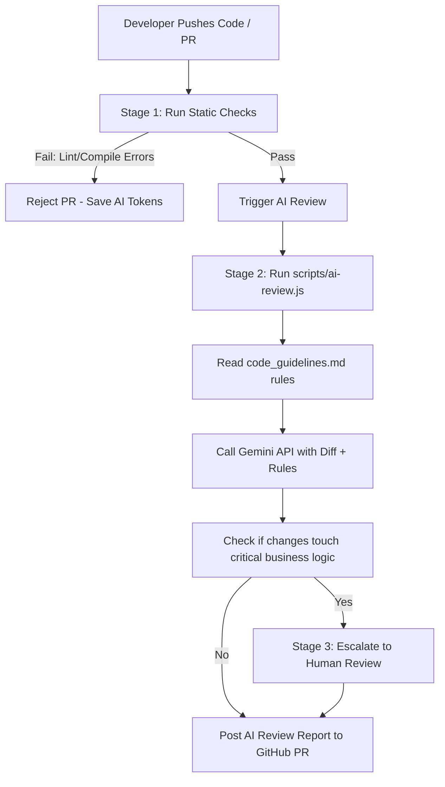

# AI-Assisted Code Review Demo & Workshop

This repository is designed to demonstrate and teach modern, engineered workflows for **AI-assisted code reviews**. It is geared towards Software Engineers, SDETs, and QA leads looking to optimize code quality assurance and review tooling.

The core philosophy of this project is:
> **"Don't treat AI like magic. Engineer your review process."**

---

## Workshop Structure

The workshop consists of three key demonstrations to showcase where AI fits (and where it does not) in the software development lifecycle:

### 1. Demo 1 – Static Checks Save AI Tokens
- **Objective:** Show that deterministic problems should never reach an AI reviewer.
- **Concept:** Save expensive intelligence for complex problems. Standard issues like linting, formatting, type check compile errors, unused variables, and unit test failures must be handled by static tools in CI.
- **Exercise File:** [cart_static_checks.spec.ts](file:///Users/raneeshchoudhary/projects/ai_code_review_demo/tests/cart/cart_static_checks.spec.ts)
- **Review Takeaway:** *"Don't spend expensive intelligence on cheap problems."*

### 2. Demo 2 – AI Review Agent
- **Objective:** Review implementation quality on the code changes (git diff).
- **Concept:** Focus the AI reviewer on semantic reasoning (bugs, security vulnerabilities, performance, error handling, maintainability, SOLID principles, logging, and testability). Ignore style preferences or formatting.
- **Review Takeaway:** *"AI is best at reviewing implementation quality."*

### 3. Demo 3 – Human Review Required
- **Objective:** Detect changes affecting critical business intent and business logic.
- **Concept:** Identify domain-critical changes (payment logic, authorization, inventory, concurrency, etc.) and flag them for human review.
- **Review Takeaway:** *"AI reviews code. Humans review intent."*

---

## Getting Started

### Prerequisites
Install the project dependencies:
```bash
npm install
```

### Running Tests
Execute the Playwright test suite:
```bash
npx playwright test
```

### Running Type Checks
Verify that TypeScript compiling passes (or fails on the static checks demo):
```bash
npx tsc --noEmit
```

---

## How the AI Code Review Works

This project demonstrates a 3-stage automated review pipeline, showing how different files are linked and how guidelines are enforced:

### The Review Flow


1. **Developer Pushes Code / Opens PR**: Triggers GitHub Actions.
2. **Stage 1 (Static Checks)**: The CI workflow (`.github/workflows/static-checks.yml`) executes standard compile checks (`npx tsc --noEmit`) and custom style greps. If code violations exist (e.g. `waitForTimeout` usage, raw `@playwright/test` imports, missing tags, or assertions inside page objects), the workflow fails. **No AI intelligence or tokens are wasted on compile or lint issues.**
3. **Stage 2 (AI Review Agent)**: If static checks pass, the **`scripts/ai-review.js`** script fetches the pull request diff and loads the project coding standards from **`code_guidelines.md`**. It passes both to the Gemini API to audit implementation quality (bugs, security, structure, clean architecture).
4. **Stage 3 (Human Review Required)**: If the change touches core business logic, payments, or security configurations, the review tool escalates the PR by marking `Human Review Required: Yes`, ensuring developers check business intent.

### File Links & Relationships
- **[code_guidelines.md](file:///Users/raneeshchoudhary/projects/ai_code_review_demo/code_guidelines.md) (Single Source of Truth)**: The primary coding standards file.
- **[.agents/AGENTS.md](file:///Users/raneeshchoudhary/projects/ai_code_review_demo/.agents/AGENTS.md) (Workspace Rules)**: A symbolic link to `code_guidelines.md`. It's automatically loaded by coding assistants (like Antigravity) to enforce rules in real-time.
- **[scripts/ai-review.js](file:///Users/raneeshchoudhary/projects/ai_code_review_demo/scripts/ai-review.js)**: Runs in CI, reads `code_guidelines.md`, calls the Gemini API to analyze the diff, and writes review comments to the PR.
- **[.agents/skills/review-code/SKILL.md](file:///Users/raneeshchoudhary/projects/ai_code_review_demo/.agents/skills/review-code/SKILL.md)**: Configures the agent's `/review-code` skill, referencing `code_guidelines.md` for standards checking.
- **[claude.md](file:///Users/raneeshchoudhary/projects/ai_code_review_demo/claude.md)**: A repository onboarding map describing file purposes and locations.

---

## Connect with the Author
Connect with **Raneesh Choudhary** on LinkedIn:
- [LinkedIn Profile](https://www.linkedin.com/in/raneesh-choudhary)

